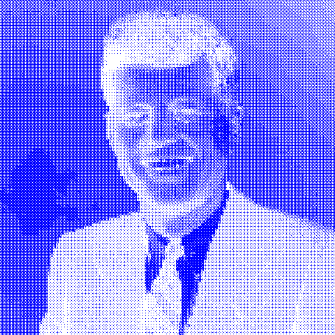

# Little Image Filter Web-App Thingy

Little Image Filter Web App Thingy is (as the name suggests) a web-app that allows users to apply photoshop-like filters to images they upload. Filters can be layered on top of one another to create interesting and varied effects.

----

## Examples
 
Original Image

&nbsp;

 
Bitmap, Invert and Gradient Map 

&nbsp;

 
Pixelate, Saturate and Noise

&nbsp;

 
Wave (Warp selected) and Wave

