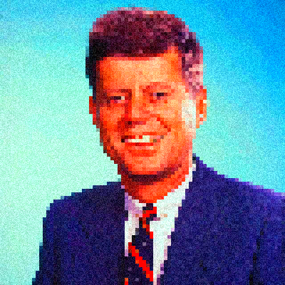

# Little Image Filter Web-App Thingy

Little Image Filter Web App Thingy is (as the name suggests) a web-app that allows users to apply photoshop-like filters to images they upload. Filters can be layered on top of one another to create interesting and varied effects.

----

## Examples

Original Image

&nbsp;

 
Bitmap, Invert and Gradient Map 

&nbsp;

Pixelate, Saturate and Noise

&nbsp;

Wave (Warp selected) and Wave

---- 

## Feature Set
This project was created in ReactJS and heavily utilized the Canvas Web API to manipulate and display images.

- Users can layer varying effects (Bitmap, Exposure, Gradient Map, Invert, Noise, Saturation, Pixelation, Threshold and Wave)
- Display resolution can be lowered to allow for faster preview renderings.
- Images can be exported as PNGs and as JPGs (JPG quality can be adjusted).

---- 
## Use it!

Little Image Filter Web-App Thingy can be tried out at <a href=" https://zackshersh.github.io/little-image-filter-thingy-app/">this link</a>. 

----

&nbsp;
&nbsp;
&nbsp;
&nbsp;

## Future Features
### Implemenation of additional filters possibly including:
  - Sobel Edge Detection
  - Basic, Radial and Directional Blurs
  - Additional distortions
### WebGL Shader mode with limited set of filters enabling much faster render times.
### Improvements to UI (in particular interfaces of certain filters)

